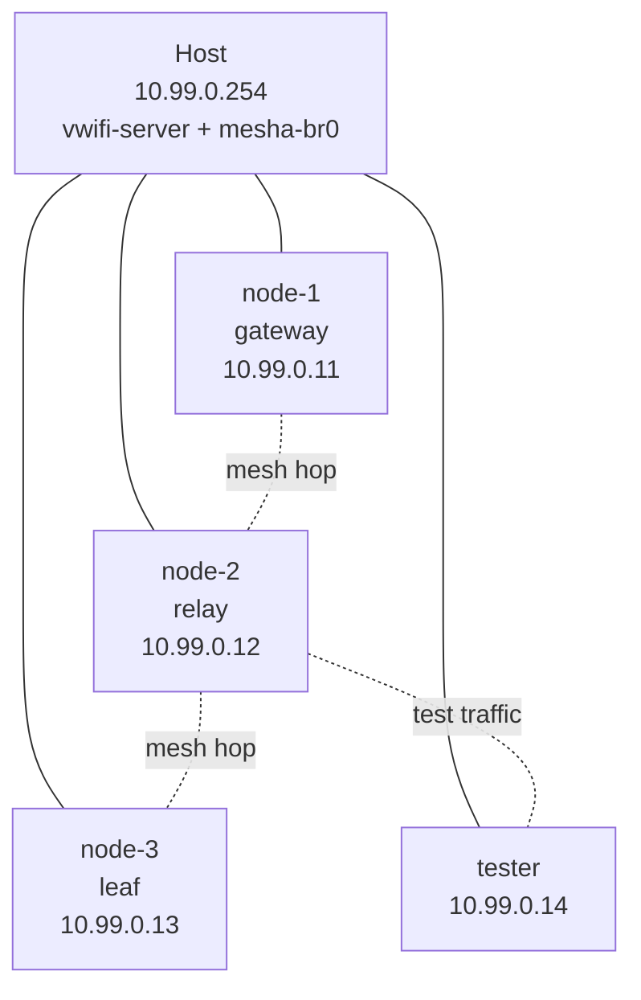

<p align="center">
  
</p>

<h1 align="center">LibreMesh Lab</h1>

<p align="center">
  A local QEMU testbed for LibreMesh and OpenWrt mesh networks.
</p>

<p align="center">
  <a href="https://github.com/coolabnet/libremesh-lab/issues">Report Bug</a>
  ·
  <a href="https://github.com/coolabnet/libremesh-lab/issues">Request Feature</a>
  ·
  <a href="docs/README.md">Read the Docs</a>
</p>

<p align="center">
  
  
  
</p>

---

## What It Is

LibreMesh Lab lets you run a small LibreMesh/OpenWrt mesh network on one Linux machine. Instead of flashing several physical routers, you boot virtual routers with QEMU and connect them through simulated Wi-Fi.

Use it to test firmware, routing, configuration changes, upgrades, rollbacks, and Mesha adapter scripts before touching real hardware.

## Why Use It?

Testing community mesh networks on real hardware is slow, expensive, and hard to repeat. LibreMesh Lab gives you a reproducible local lab with:

- **4 virtual LibreMesh routers**: gateway, relay, leaf, and tester.
- **Simulated Wi-Fi mesh**: no wireless hardware required.
- **Multi-hop topologies**: line, star, and partition layouts.
- **Mesh protocol checks**: BMX7 and Babel-oriented validation.
- **Safe firmware and config testing**: drift detection, upgrade simulation, rollback flows.
- **Mesha integration**: run adapter scripts against a realistic lab backend.

## How It Works



The host creates a management bridge, starts a virtual Wi-Fi relay, and boots four QEMU VMs. Each VM runs LibreMesh/OpenWrt firmware and gets interfaces for management SSH, internet access, and mesh simulation.

The main pieces are:

| Piece | What it is used for |
|---|---|
| **QEMU** | Runs the virtual LibreMesh/OpenWrt routers. |
| **vwifi** | Simulates Wi-Fi links between VMs without physical radios. |
| **Linux bridge + TAP devices** | Gives the host and VMs a management network for SSH and testing. |
| **dnsmasq** | Provides DHCP on the management network. |
| **wmediumd + mac80211_hwsim** | Optional advanced wireless simulation for namespace tests. |
| **BMX7 / Babel** | Mesh routing protocols validated inside the lab. |
| **Bash** | Project runtime: CLI, orchestration scripts, and tests. |

Read the deeper explanation in [docs/architecture.md](docs/architecture.md).

## Quick Start

### Install

```bash
curl -fsSL https://raw.githubusercontent.com/coolabnet/libremesh-lab/main/scripts/install.sh | bash
```

This installs the CLI as `libremesh-lab` under `~/.local/bin` and clones the project under `~/.local/share/libremesh-lab`.

From a local checkout, use `bin/libremesh-lab` instead of `libremesh-lab`.

### Build, Start, Test

```bash
# 1. Build or prepare a LibreMesh firmware image
libremesh-lab build-image

# 2. Start the virtual mesh network
# Requires root for bridge, TAP, dnsmasq, and QEMU networking
sudo libremesh-lab start

# 3. Wait about 90 seconds for VMs to boot, then configure them
libremesh-lab configure

# 4. Run safe VM-free checks
libremesh-lab test --suite fast

# 5. Check lab status
libremesh-lab status

# 6. Tear down the lab when done
sudo libremesh-lab stop
```

For full VM-backed checks after the lab is running:

```bash
libremesh-lab test --suite lab
MESHA_ROOT=/path/to/mesha libremesh-lab test --suite adapter
```

For the safest full cleanup, especially on shared hosts:

```bash
sudo bin/rollback-lab.sh
```

## Common Use Cases

| I want to... | Start here |
|---|---|
| Test a firmware image | `libremesh-lab build-image`, then `sudo libremesh-lab start` |
| Check mesh convergence | `libremesh-lab test --suite lab` |
| Validate config drift or rollback | `libremesh-lab test --suite lab` |
| Run Mesha adapter scripts | [docs/mesha-integration.md](docs/mesha-integration.md) |
| Run CI-safe checks | `libremesh-lab test --suite fast` |
| Debug VM or networking issues | [docs/troubleshooting.md](docs/troubleshooting.md) |

## CLI Reference

```text
libremesh-lab <command> [args...]

Commands:
  build-image              Build or prepare a LibreMesh firmware image
  start                    Start the QEMU/vwifi lab
  configure                Configure booted lab VMs
  stop                     Stop VMs and clean networking state
  status                   Print lab status as JSON
  logs                     Collect lab logs
  test [--suite fast]      Run lab tests; default suite is fast
  run-adapter <script>     Run an external adapter against lab config
```

## Test Suites

`libremesh-lab test` defaults to the safe `fast` suite. Broader suites are available when you have a running lab or an isolated root-capable host.

| Suite | Purpose |
|---|---|
| `fast` | CLI contract, adapter-wrapper isolation, namespace preflight. No VMs or root required. |
| `lab` | Mesh protocol, topology, config drift, rollback, and upgrade checks against running VMs. |
| `adapter` | Mesha adapter validation against a running lab. Requires `MESHA_ROOT`. |
| `lifecycle` | Destructive start/stop cleanup coverage. Requires `RUN_LIFECYCLE_TESTS=1`. |
| `namespace` | Optional `mac80211_hwsim` + `wmediumd` wireless smoke test. |

See [docs/testing.md](docs/testing.md) for the full test matrix.

## Requirements

| Resource | Minimum | Recommended |
|---|---:|---:|
| RAM | 4 GB | 8 GB |
| CPU | 2 cores | 4+ cores with KVM |
| Disk | 2 GB | 5 GB |
| OS | Linux | Linux with KVM |

Main software dependencies:

- `bash` 4+
- `git`, `curl`, `ssh`
- `qemu-system-x86_64`
- `iproute2`, `bridge-utils`
- `dnsmasq`

Root is required for commands that create or remove host networking state (`start`, `stop`, lifecycle tests, and some image preparation flows). Most read-only commands and the `fast` test suite run unprivileged.

## Documentation

- [Complete guide](docs/README.md)
- [Architecture](docs/architecture.md)
- [Testing](docs/testing.md)
- [Mesha integration](docs/mesha-integration.md)
- [Contributing](docs/contributing.md)
- [Troubleshooting](docs/troubleshooting.md)
- [Self-hosted runner setup](docs/self-hosted-runner.md)
- [QEMU adapter test guide](docs/qemu-adapter-test-guide.md)

## Contributing

Contributions are welcome. Shell scripts use Bash with `set -euo pipefail`, test files follow `test-*.sh`, YAML uses two-space indentation, and commits should follow [Conventional Commits](https://www.conventionalcommits.org/).

See [docs/contributing.md](docs/contributing.md) for development conventions and safety notes.

## License

LibreMesh Lab is free software. See the project license file when present in your checkout.

## Links

- [LibreMesh](https://libremesh.org)
- [OpenWrt](https://openwrt.org)
- [Mesha](https://github.com/coolabnet/mesha)
- [Cooolab](https://coolab.org)
