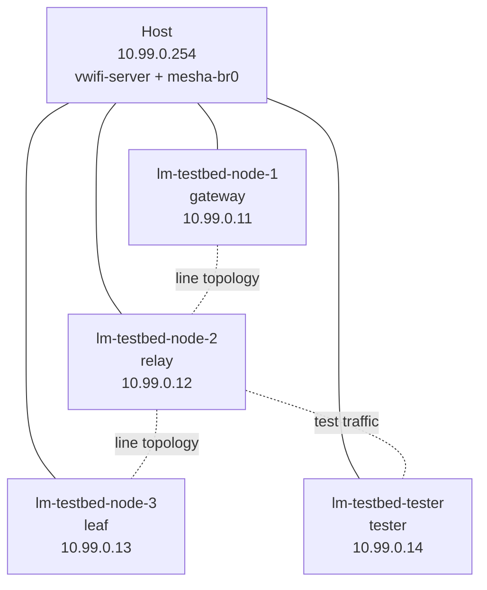

# Architecture

LibreMesh Lab runs a small virtual LibreMesh/OpenWrt network on one Linux host. It is built from Bash scripts, QEMU virtual machines, Linux networking, and wireless simulation tools.

## High-Level Layout



The default lab starts four VMs:

| VM | IP | Role | Default RAM |
|---|---|---|---:|
| `lm-testbed-node-1` | `10.99.0.11` | gateway | 256 MB |
| `lm-testbed-node-2` | `10.99.0.12` | relay | 256 MB |
| `lm-testbed-node-3` | `10.99.0.13` | leaf | 256 MB |
| `lm-testbed-tester` | `10.99.0.14` | tester | 512 MB |

The host uses `10.99.0.254` on the management network.

## VM Interfaces

Each VM has three network paths:

| Interface | Type | Purpose |
|---|---|---|
| `mesh0` | TAP device via `mesha-br0` | Management SSH and wired mesh access. |
| `wan0` | QEMU user-mode networking | Internet access from inside the VM. |
| `wlan0` | vwifi client | Simulated Wi-Fi mesh traffic. |

## Main Building Blocks

| Component | Used for |
|---|---|
| QEMU (`qemu-system-x86_64`) | Boots real LibreMesh/OpenWrt firmware images as VMs. |
| `vwifi` | Relays simulated Wi-Fi frames between VMs without physical radios. |
| Linux bridge (`mesha-br0`) | Connects the host and VM TAP devices on a management network. |
| TAP devices (`mesha-tap*`) | Virtual Ethernet ports attached to the VMs. |
| `dnsmasq` | Provides DHCP on the management network. |
| `mac80211_hwsim` | Linux kernel module for disposable simulated radios in namespace tests. |
| `wmediumd` | Optional wireless medium simulator for namespace-based smoke tests. |
| BMX7 / Babel | Mesh routing protocols checked inside the virtual network. |

## Topologies

Topology files live in `config/`.

| Topology | File | Layout |
|---|---|---|
| Line | `config/topology.yaml` / `config/topology-line.yaml` | `node-1 -> node-2 -> node-3` multi-hop path. |
| Star | `config/topology-star.yaml` | `node-1` as hub with spokes. |
| Partition | `config/topology-partition.yaml` | Split network for partition testing. |

The default topology is the line layout. It is designed to exercise multi-hop routing through the relay node.

## Runtime Flow

1. `build-image` builds or prepares a LibreMesh/OpenWrt firmware image.
2. `start` creates runtime directories, takes a lock, starts vwifi, sets up host networking, and boots the VMs.
3. `configure` waits for SSH and applies hostnames, IP addresses, mesh protocol settings, and SSH keys.
4. `test` runs one of the selected test suites.
5. `stop` or `rollback-lab.sh` tears down VM and host networking state.

## Project Structure

```text
libremesh-lab/
├── bin/
│   ├── libremesh-lab            # Main CLI entrypoint
│   └── rollback-lab.sh          # Comprehensive cleanup helper
├── config/
│   ├── topology*.yaml           # Lab topology definitions
│   ├── ssh-config               # SSH template for VMs
│   ├── inventories/             # Node inventories
│   └── desired-state/           # Desired mesh configuration state
├── docker/qemu-builder/         # Optional Docker image builder
├── docs/                        # User-facing documentation
├── images/                      # Generated/downloaded firmware images; gitignored except README
├── scripts/qemu/                # QEMU lifecycle and helper scripts
├── src/                         # External checkouts; gitignored
├── tests/qemu/                  # Bash integration tests
└── run/                         # Runtime state, logs, PID files, SSH keys; gitignored
```

## Important Safety Notes

- The default bridge name is `mesha-br0`; changing it can break tests and Mesha integration assumptions.
- `run/`, generated firmware images, logs, keys, and local runtime files should not be committed.
- Use `sudo bin/rollback-lab.sh` as the safe teardown after a start/configure/test session.
